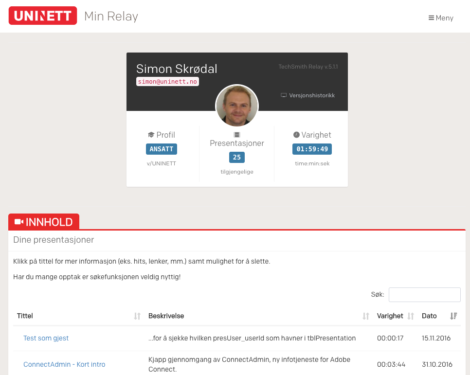
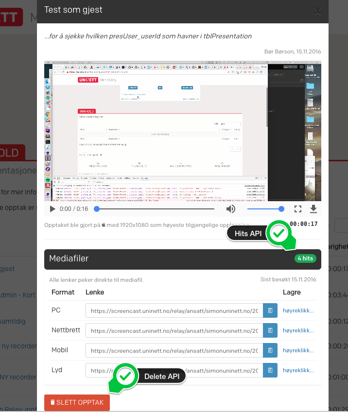

# Min Relay

*Note: This client is developed by UNINETT AS and is tailor-made to suit higher education in Norway. 
It uses in-house developed APIs pertaining to a specific use-case and relies heavily on UNINETT Dataporten (for OAuth). 
Dependencies also require access to a self-hosted instance of TechSmith Relay.* 

Access to the client, regardless of user role, is enforced by Dataporten auth.

## Info 

Min Relay is a single-page web client that provides information views pertaining to an account holder's 
content. All information is drawn from Relay's own DB (read-only!), except:
 
 - Delete functionality, reads/writes to data source define by https://github.com/skrodal/techsmith-relay-presentation-delete
 - Hits, reads from data source generated by https://github.com/skrodal/relay-iis-logparser

## Requirements
 
The client
 
- must be registered in Dataporten in order to get the required `Client ID` and `Client Secret` 
- requires Dataporten scopes `profile` `userid` `userid-feide`
- requires Dataporten access to the Min Relay API
 
The client also requires the Colfax font library (not included in this repo due to license restrictions).

## 3rd parties

- Bootstrap 3
    - makes use of a modified version of the excellent "AdminLTE"
    - uses UNINETTs Bootstrap template
- JSO v2 av Andreas Åkre Solberg (https://github.com/andreassolberg/jso)
- DataTables
- Moment.js

## About

Client + API developed by Simon Skrødal, November 2016 